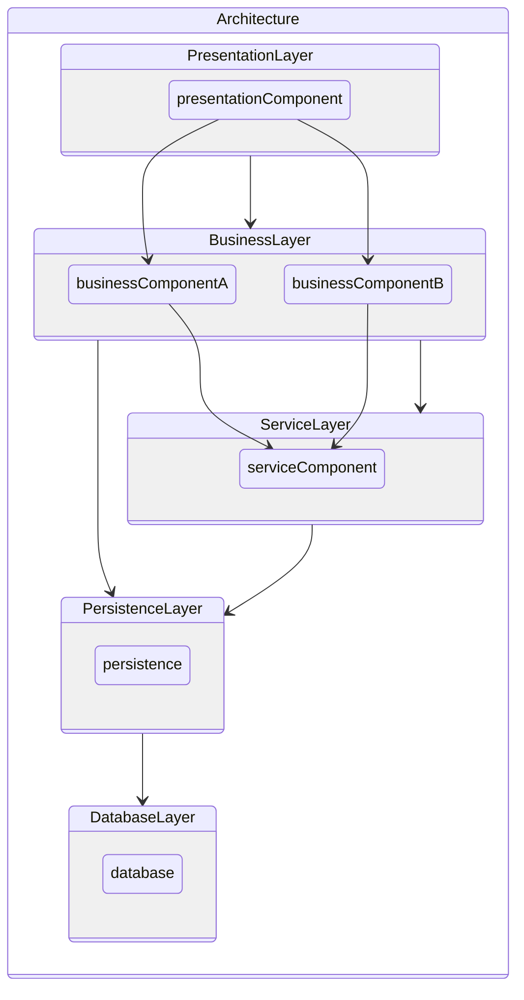

# express-typescript-boilerplate

## Use Packages
- Express.js
- Sequelize

## Architecture Diagram


```mermaid
stateDiagram-v2

    state Architecture {
    
        state PresentationLayer {
             presentationComponent --> businessComponentA
             presentationComponent --> businessComponentB

        }
        
        PresentationLayer --> BusinessLayer
        
        state BusinessLayer {
            businessComponentA --> serviceComponent
            businessComponentB --> serviceComponent

        }
        
        BusinessLayer --> ServiceLayer
        BusinessLayer --> PersistenceLayer

        state ServiceLayer {
            serviceComponent

        }
        
        ServiceLayer --> PersistenceLayer
        
        state PersistenceLayer {
            persistence

        }
        
        PersistenceLayer --> DatabaseLayer
        
        state DatabaseLayer {
            database
        }

    }
```

## Setup

```
npm ci
```

## Run
```
npm run start
```
