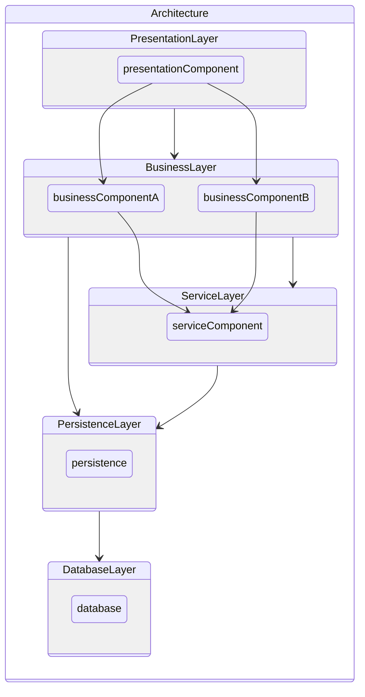

# express-typescript-boilerplate

Typescriptでバックエンドを構築する際のテンプレートになります。

ソフトウェアアーキテクチャの基礎 p.7 のアーキテクチャ図を参考に作成しました。

https://www.oreilly.co.jp/books/9784873119823/

## Use Packages
- Express.js
- Sequelize

## Architecture Diagram

Mermaid記法で作成



- PresentationLayer
    - プレゼンテーション層
        - 主に外部インターフェースとの接続部分として使用する。

- BusinessLayer
    - ビジネス層
        - 業務ドメインで使用する処理の単位。（発注、決済、発送、帳票処理などなるべくモジュール化してプレゼンテーション層で再利用できるように設計する）

- ServiceLayer
    - サービス層
        - CRUDの処理を行う。

- PersistenceLayer
    - 永続化層
        - モデルの作成（型定義）などを担当。

- DatabaseLayer
    - データベース層
        - データベースとの接続を担当。今回はSequelizeというPackageが担当。

## Setup

```
npm ci
```

## Run
```
npm run start
```
